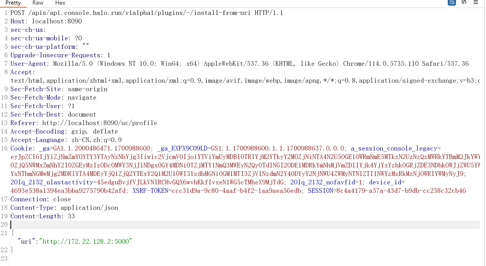
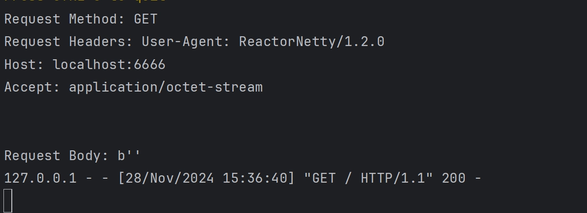
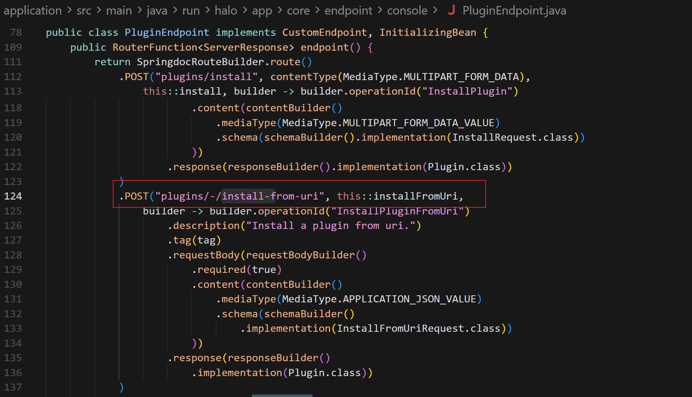
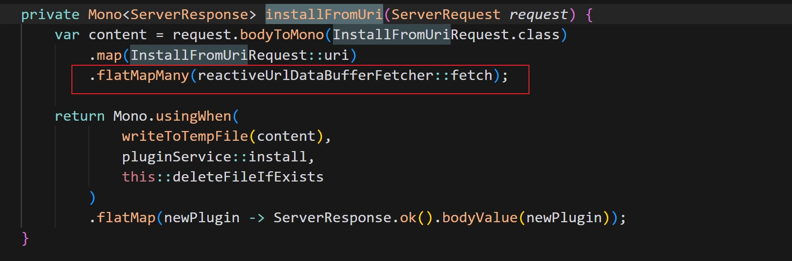
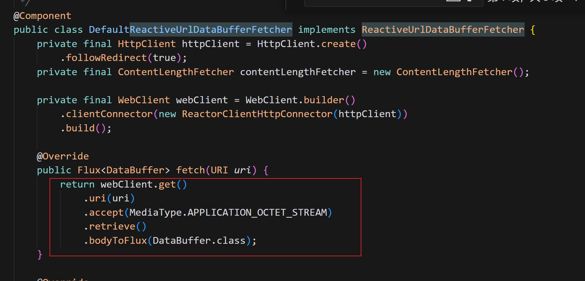

# The endpoint `/apis/uc.api.storage.halo.run/v1alpha1/plugins/-/install-from-uri` of Halo is vulnerable to SSRF attacks

## Affected Version

2.22.14  https://github.com/halo-dev/halo (latest version)

## Impact

It is possible to send SSRF (Server-Side Request Forgery) requests to internal networks, but it is limited to HTTP GET requests. If there is an HTTP service running on an internal port that is not exposed externally, it may lead to a resource disclosure issue. The attack only requires ordinary user privileges.

## Exploitation Steps

1. Use the endpoint `/apis/uc.api.storage.halo.run/v1alpha1/plugins/-/install-from-uri` to send a request to an attacker-controlled server ([`http://172.22.128.2:5000`](http://172.22.128.2:5000/)).
2. The attacker-controlled server is used to filter the `HEAD` request and redirect the `GET` request to an internal network address.

1. A service running on the internal network on port 6666 receives the corresponding `GET` request sent by Halo. And the response to the request can be directly obtained by the attacker.

## Root Cause

The application implements a plugin upgrade feature that allows users to specify arbitrary URIs for downloading plugin updates. The vulnerability exists in the `DefaultReactiveUrlDataBufferFetcher` class, which is responsible for fetching plugin data from remote URLs.

### Technical Details

1. **Unvalidated URI Input**: The `InstallFromUriRequest` accepts user-controlled URI input without any validation or sanitization.
2. **Direct HTTP Request Execution**: The `fetch()` method in `DefaultReactiveUrlDataBufferFetcher` directly passes the user-supplied URI to `WebClient.get().uri(uri)` without any security checks:
3. **No Protocol Restriction**: The implementation does not restrict the URI scheme,  allowing protocols  HTTP/HTTPS.
4. **No Host Validation**: There is no whitelist or blacklist mechanism to prevent requests to internal network addresses.

## Suggested Fix

Implement a blacklist mechanism to filter internal IP addresses.